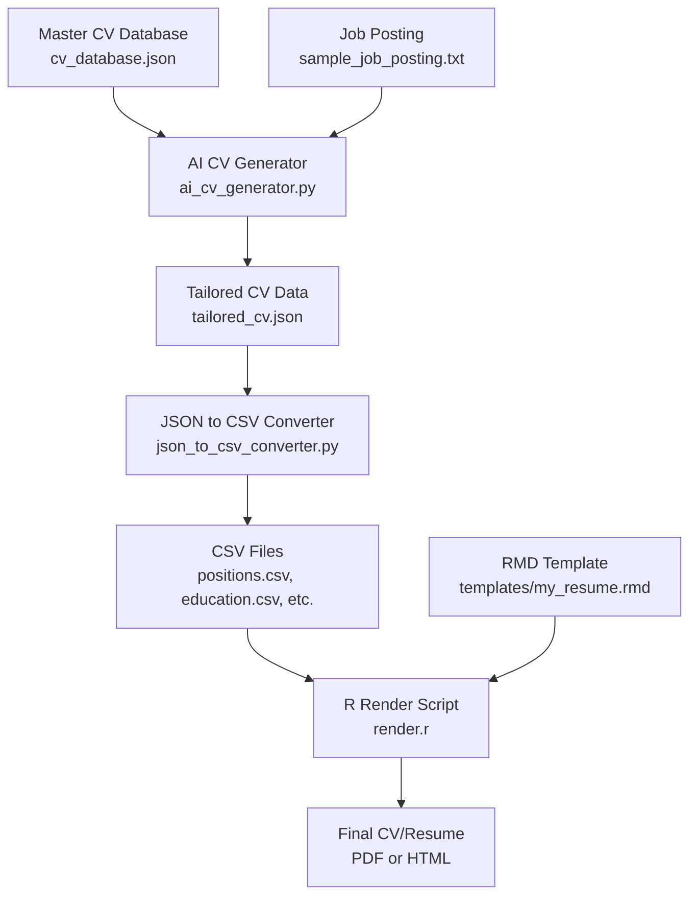

```mermaid
graph TD
    A[Master CV Database<br>cv_database.json] --> B[AI CV Generator<br>ai_cv_generator.py]
    J[Job Posting<br>sample_job_posting.txt] --> B
    B --> C[Tailored CV Data<br>tailored_cv.json]
    C --> D[JSON to CSV Converter<br>json_to_csv_converter.py]
    D --> E[CSV Files<br>positions.csv, education.csv, etc.]
    E --> F[R Render Script<br>render.r]
    G[RMD Template<br>templates/my_resume.rmd] --> F
    F --> H[Final CV/Resume<br>PDF or HTML]
```
